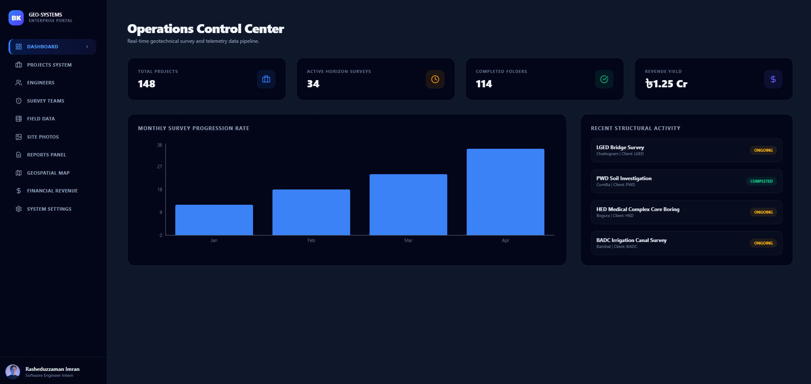
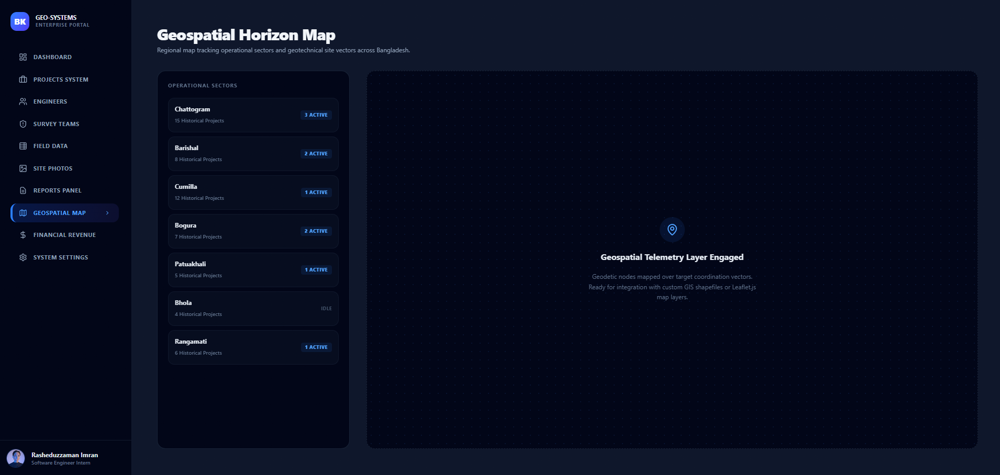
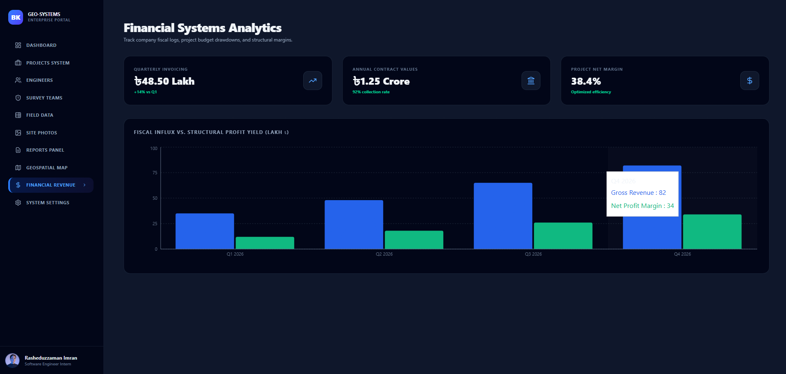

# Project Management & Field Survey System
### 🇧🇩 BK Geotech Engineering and Constructions — Enterprise Management Suite

A production-ready, data-driven project management and field telemetry dashboard built during my tenure as a Software Engineer Intern at BK Geotech Engineering & Construction Ltd. This system is designed to digitize operational logging, resource allocation, and field status tracking across **20+ districts and 120+ upazilas** in Bangladesh, tailoring workflows for major client authorities including **LGED, PWD, HED, and BADC**.

## 🚀 Specialized Functional Modules

* **Operations Control Center (Dashboard):** Features dynamic metrics trackers (Total, Ongoing, Completed Projects, and Revenue Analytics) alongside a live structural activity stream.
* **Project Registries Matrix:** A filterable and searchable multi-criteria data logging grid tracking municipal budget allocations, target deadlines, and assigned field teams.
* **Field Engineers Roster:** A clean, card-based personnel management directory mapping engineering staff and current project loads.
* **Team Assignment Desk:** An interactive configuration dashboard detailing personnel structures (Engineers, Surveyors, Technicians, and Logistics Drivers) deployed to active sectors.
* **Geotechnical Field Logs:** High-precision telemetry data grids tracking execution data, borehole drills count, and physical soil sample counts.
* **Site Media Gallery:** A responsive photography evidence engine designed to visually archive drilling configurations, field setups, and on-site testing.
* **Report Engineering Desk:** A secure file aggregation sub-module managing compiled engineering reports, digital bore logs, and verification attachments.
* **Geospatial Horizon Map:** An industrial GIS tracking framework mapping target coordinate vectors over regional engineering nodes across Bangladesh.
* **Financial Revenue Analytics:** Interactive time-series charts evaluating gross quarter-on-quarter contract revenues against net project yield margins.

## 🛠️ Tech Stack & Architecture
* **Frontend Core:** React (Vite-optimized production execution bundle)
* **Design & Styling Engine:** Tailwind CSS v4 (Compiled natively via `@tailwindcss/vite` plugin architecture)
* **Routing Infrastructure:** React Router DOM (Single Page Application State-Preserving Client Router)
* **Data Visualization:** Recharts (SVG-driven responsive charting layer)
* **Vector Icon Components:** Lucide React

## 📸 Core Workspace Architecture Viewports
*(Replace these placeholder paths with your actual screenshots saved inside your local project)*
* **Operations Control Center Dashboard:** 

* **Geospatial Asset Mapping:** 

* **Field Photography Evidence Engine:** 


## 💻 Local Installation & Initialization
To review the operational execution layers of this platform inside a local workspace environment, utilize these terminal instructions:

```bash
# 1. Clone the project tree mapping directory profiles
git clone [https://github.com/YOUR_GITHUB_USERNAME/project-management-system.git](https://github.com/YOUR_GITHUB_USERNAME/project-management-system.git)

# 2. Navigate into the root execution directory
cd project-management-system

# 3. Provision local package lock ecosystems
npm install

# 4. Spin up the modern hot-reloading development server
npm run dev